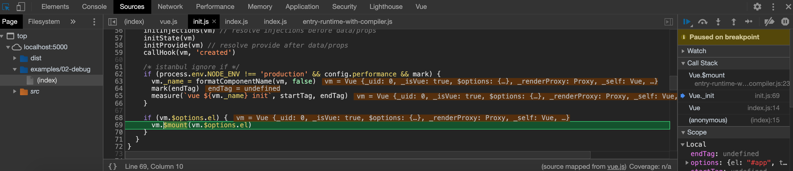
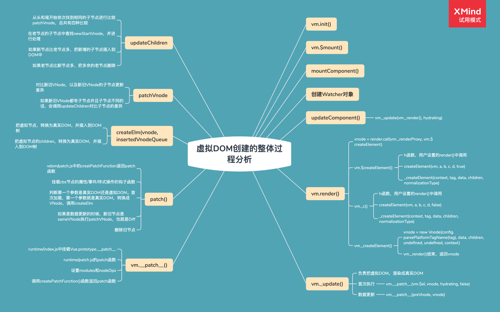

# Vue.js 源码分析（响应式、虚拟 DOM、模板编译和组件化）

## Vue.js 源码剖析-响应式原理

### 一、准备工作

#### 1. Vue 源码的获取

- 项目地址：https://github.com/vuejs/vue
- Fork 一份到自己仓库，克隆到本地，可以自己写注释提交到 GitHub
- 为什么分析 Vue2.6
  - 到目前为止 Vue3.0 的正式版还没有发布
  - 新版本发布后，现有项目不会升级到 3.0，2.x 还有很长的一段过渡期
  - 3.0 项目地址：http://github.com/vuejs/vue-next

#### 2. 源码目录结构

> src
>
> |——compiler 编译相关
>
> |——core Vue 核心库
>
> |——platforms 平台相关代码
>
> |——server SSR、服务器端渲染
>
> |——sfc .vue 文件编译为 js 对象
>
> |——shared 公共的 diamante

#### 3. 了解 Flow

- 官网：https://flow.org/
- JavaScript 的静态类型检查器
- Flow 的静态类型检查错误是通过静态类型推断实现的
  - 文件开头通过 `// @flow` 或者 `/* @flow */`声明

```js
/* @flow */
function square(n: number): number {
  return n * n;
}
square("2"); // Error!
```

#### 4. 调试设置

##### (1). 打包

- 打包工具 Rollup

  - Vue.js 源码的打包工具使用时 Rollup，比 Webpack 轻量
  - Webpack 把所有文件当做模块，Rollup 只处理 js 文件，更适合在 Vue.js 这样的库中使用
  - Rollup 打包不会生成冗余的代码

- 安装依赖

  ```sh
  yarn
  ```

- 设置 sourcemap

  - package.json 文件中的 dev 脚本中添加参数 --sourcemap

  ```json
  "dev": "rollup -w -c scripts/config.js --sourcemap --environment TARGET:web-full-dev"
  ```

- 执行 dev

  - `yarn dev`执行打包，用的是 Rollup，-w 参数是监听文件的变化，文件变化自动重新打包
  - 结果: 生成了 dist 目录

- 执行 build

  - `yarn build`生成了不同版本的 Vue

### 二、 Vue 的不同构建版本

#### 1. Vue 的不同构建版本

- `npm run build` 重新打包所有文件
- 官方文档-[对不同构建版本的解释](<[https://cn.vuejs.org/v2/guide/installation.html#%E5%AF%B9%E4%B8%8D%E5%90%8C%E6%9E%84%E5%BB%BA%E7%89%88%E6%9C%AC%E7%9A%84%E8%A7%A3%E9%87%8A](https://cn.vuejs.org/v2/guide/installation.html#对不同构建版本的解释)>)
- dist/README.md

| UMD                          | CommonJS           | ES Module<br/>(基于构建工具使用) | ES Module<br/>(直接用于浏览器) |                        |
| :--------------------------- | ------------------ | -------------------------------- | ------------------------------ | ---------------------- |
| **完整版**                   | vue.js             | vue.common.js                    | vue.esm.js                     | vue.esm.browser.js     |
| **只包含运行时版**           | vue.runtime.js     | vue.runtime.common.js            | vue.runtime.esm.js             | -                      |
| **完整版(生产环境)**         | vue.min.js         | -                                | -                              | vue.esm.browser.min.js |
| **只包含运行时版(生产环境)** | vue.runtime.min.js | -                                | -                              | -                      |

#### 2. 术语

- **完整版**：同时包含编译器和运行时的版本。
- **编译器**：用来将模板字符串编译成为 JavaScript 渲染函数的代码，体积大，效率低。
- **运行时**：用来创建 Vue 实例、渲染并处理虚拟 DOM 等的代码。体积小，效率高，基本上就是除去编译器的其它一切。
- **[UMD](https://github.com/umdjs/umd)**：通用的模块版本，支持多种模块方式。UMD 版本可以通过 `<script>` 标签直接用在浏览器中。jsDelivr CDN 的 https://cdn.jsdelivr.net/npm/vue 默认文件就是运行时 + 编译器的 UMD 版本 (`vue.js`)。
- **[CommonJS](http://wiki.commonjs.org/wiki/Modules/1.1)**：CommonJS 版本用来配合老的打包工具比如 [Browserify](http://browserify.org/) 或 [webpack 1](https://webpack.github.io/)。这些打包工具的默认文件 (`pkg.main`) 是只包含运行时的 CommonJS 版本 (`vue.runtime.common.js`)。
- **[ES Module](http://exploringjs.com/es6/ch_modules.html)**：从 2.6 开始 Vue 会提供两个 ES Modules (ESM) 构建文件：
  - 为打包工具提供的 ESM：为诸如 [webpack 2](https://webpack.js.org/) 或 [Rollup](https://rollupjs.org/) 提供的现代打包工具。ESM 格式被设计为可以被静态分析，所以打包工具可以利用这一点来进行“tree-shaking”并将用不到的代码排除出最终的包。为这些打包工具提供的默认文件 (`pkg.module`) 是只有运行时的 ES Module 构建 (`vue.runtime.esm.js`)。
  - 为浏览器提供的 ESM (2.6+)：用于在现代浏览器中通过 `<script type="module">` 直接导入。

> vue 脚手架创建的 Vue 项目中，引用的 Vue 版本就是运行时版本：vue.runtime.esm.js
>
> 我们可以在 Vue 项目中执行：`vue inspect > output.js`，将 webpack 配置输出到 output.js 文件中查看，
>
> ```js
> resolve: {
>     alias: {
>       '@': '/Users/mac/JALProjects/lagou-fed/fed-e-task-03-02/code/01-demo/src',
>       vue$: 'vue/dist/vue.runtime.esm.js'
>     },
> }
> ```

### 三、 寻找入口文件

查看 dist/vue.js 的构建过程

执行构建： `yarn dev`

### 四、 从入口开始

src/platform/web/entry-runtime-with-compiler.js

通过查看源码解决下面问题：

#### 1. 问：观察一下代码，通过阅读源码，回答在页面上输出的结果

```js
const vm = new Vue({
  el: "#app",
  template: "<h1>Hello template </h1>",
  render(h) {
    return h("h4", "Hello render");
  },
});
```

答：是优先使用 render


#### 2. 问：\$mount 是在什么时候调用的？

答：是在 init 方法中调用的，可以在\$mount 函数定义的地方打断点，然后看调用栈的函数



#### 3. 学习源码记录

- el 不能是 body 或者是 html 标签
- 如果没有 render，把 template 转换成 render 函数
- 如果有 render 方法，直接调用 mount 挂载 DOM

#### 4. 调试代码

- 调试的方法

  - 查看浏览器开发人员工具里 Sources 的 CallStack 调用堆栈

  > Vue 的构造函数在哪个？
  >
  > Vue 实例的成员/Vue 的静态成员从哪里来的？

### 五、Vue 的初始化过程

#### 1. 四个导出 Vue 的模块

##### (1). src/platforms/web/entry-runtime-with-compilerjs

- web 平台相关的入口

- 重写了平台相关的

- `$mount()`方法

- 注册了 Vue.compile()方法，传递一个 HTML 字符串返回 render 函数

##### (2). src/platforms/web/runtime/index.js

- web 平台相关
- 注册和平台相关的全局指令: `v-model`、 `v-show`
- 注册和平台相关的全局组件: `v- transition`,`v-transition-group`
- 全局方法:
  - `_patch_`: 把虚拟 DOM 转换成真实 DOM
  - `$mount`:挂载方法

##### (3). src/core/index.js

- 与平台无关
- 设置了 Vue 的静态方法，initGlobalAPl(Vue)

##### (4). src/core/instance/index.js

- 与平台无关
- 定义了构造函数，调用了 this.init(options) 方法
- 给 Vue 中混入了常用的实例成员

#### 2. 看源码中的两个问题

##### (1) 关闭 JS 语法检查爆红问题

在 vscode 的 settings.json 里，将"javascript.validate.enable"设为 false

##### (2) flow 中的泛型影响代码的高亮显示

在 vscode 插件商城里安装 Babel JavaScript 这个插件，可以让泛型后面的代码可以高亮显示，但失去了跳转链接的作用


#### 3. 静态方法

./src/core/global-api/index.js

```js
// 设置keep-alive组件
extend(Vue.options.components, builtInComponents);

// 注册Vue.use()用来注册组件
initUse(Vue);
// 注册Vue.mixin()实现混入
initMixin(Vue);
// 注册Vue.extend()基础传入的options返回一个组件的构造函数
initExtend(Vue);
// 注册Vue.directive()、Vue.component()、Vue.filter()
initAssetRegisters(Vue);
```

#### 4. 实例成员

./src/core/instance/index.js

```js
// 注册vm的_init()方法，初始化vm
initMixin(Vue);
// 注册vm的$data/$props/$set/$delete/$watch
stateMixin(Vue);
// 初始化事件相关方法
// $on/$once/$off/$emit
eventsMixin(Vue);
// 初始化生命周期相关的混入方法
// _update/$forceUpdate/$destroy
lifecycleMixin(Vue);
// 混入render
// $nextTick/_render
renderMixin(Vue);
```

#### 5. 构造函数

构造函数中调用了 init 方法。

./src/core/instance/init.js

```js
// vm的生命周期相关变量初始化
// $children/$parent/$root/$refs
initLifecycle(vm);
// vm的事件监听初始化，父组件绑定在当前组件上的事件
initEvents(vm);
// vm的编译render初始化
// $slots/$scopedSlots/_c/$createElement/$attrs/$listeners
initRender(vm);
// beforeCreate 生命钩子回调
callHook(vm, "beforeCreate");
// 把inject的成员注入到vm上
initInjections(vm); // resolve injections before data/props
// 初始化vm的_props/methods/_data/computed/watch
initState(vm);
// 初始化provide
initProvide(vm); // resolve provide after data/props
// created 生命钩子的回调
callHook(vm, "created");
```

#### 6. 首次渲染过程

首先进行 Vue 的初始化，也就是初始化 Vue 的实例成员以及静态成员。

当初始化结束之后，开始调用构造函数，在构造函数中调用`this._init()`，这个方法相当于我们整个`Vue`的入口。

在`_init()`中最终调用了`this.$mount()`，共有两个`$mount()`，第一个`$mount()`是`entry-runtime-with-compiler.js`入口文件的`$mount()`，这个`$mount()`的核心作用是帮我们把模板编译成`render`函数，但它首先会判断一下我们当前是否传入了`render`选项，如果没有传入的话，它会去获取我们的`template`选项，如果`template`选项也没有的话，他会把`el`中的内容作为我们的模板，然后把模板编译成`render`函数，它是通过`compileToFunctions()`函数，帮我们把模板编译成`render`函数的,当把`render`函数编译好之后，它会把`render`函数存在我们的`options.render`中。

那接下来会调用`runtime/index.js`中的`$mount()`方法，这个方法中,首先会重新获取我们的`el`，因为如果是运行时版本的话，是不会`entry-runtime-with-compiler.js`这个入口中获取`el`，所以如果是运行时版本的话，我们会在`runtime/index.js`的`$mount()`中重新获取`el`。

接下来调用`mountComponent()`,`mountComponent()`是在`src/core/instance/lifecycle.js`中定义的，在`mountComponent()`中，首先会判断`render`选项，如果没有但是传入了模板，并且当前是开发环境的话会发送警告，警告运行时版本不支持编译器。

接下来会触发`beforeMount`这个生命周期中的钩子函数，也就是开始挂载之前。

然后定义了`updateComponent()`，在这个方法中，定义了`_render`和`_update`，`_render`的作用是生成虚拟 DOM，`_update`的作用是将虚拟 DOM 转换成真实 DOM，并且挂载到页面上来。

再接下来就是创建`Watcher`对象，在创建`Watcher`时，传递了`updateComponent`这个函数，这个函数最终是在`Watcher`内部调用的。在`Watcher`创建完之后还调用了`get`方法，在`get`方法中，会调用`updateComponent()`。

然后触发了生命周期的钩子函数`mounted`,挂载结束，最终返回`Vue`实例。


#### 7. 响应式处理过程

- initState() --> initData() --> observe()
- observe(value)
  - 位置：src/core/observer/index.js
  - 功能：
    - 判断 value 是否是对象，如果不是对象直接返回
    - 判断 value 对象是否有`__ob__`,如果有直接返回
    - 如果没有，创建 observer 对象
    - 返回 observer 对象
- Observer
  - 位置：src/core/observer/index.js
  - 功能：
    - 给 value 对象定义不可枚举的`__ob__`属性，记录当前的 observer 对象
    - 数组的响应式处理
    - 对象的响应式处理，调用 walk 方法
- defineReactIve

  - 位置：src/core/observer/index.js
  - 功能：
    - 为每一个属性创建 dep 对象
    - 如果当前属性的值是对象，调用 observe
    - 定义 getter
      - 收集依赖
      - 返回属性的值
    - 定义 setter
      - 保存新值
      - 如果新值是对象，调用 observe
      - 派发更新（发送通知），调用 dep.notify()

- 收集依赖
  - 在 watcher 对象的 get 方法中调用 pushTarget 记录 Dep.target 属性
  - 访问 data 中的成员的时候收集依赖，defineReactive 的 getter 中收集依赖
  - 把属性对应的 watcher 对象添加到 dep 的 subs 数组中
  - 给 childOb 收集依赖，目的是子对象添加和删除成员时发送通知
- Watcher
  - dep.notify()在调用 watcher 对象的 update()方法
  - queueWatcher()判断 watcher 是否被处理，如果没有的话添加到 queue 队列中，并调用 flushScheduleQueue()
  - flushScheduleQueue()
    - 触发 beforeUpdate 钩子函数
    - 调用 watcher.run()： run() --> get() --> getter() --> updateComponent
    - 清空上一次的依赖
    - 触发 actived 的钩子函数
    - 触发 updated 钩子函数

#### 8. Vue 给响应式对象添加一个响应式属性--set 方法

- Vue.set()定义位置：global-api/index.js

  ```js
  // 静态方法：set/delete/nextTick
  Vue.set = set;
  Vue.delete = del;
  Vue.nextTick = nextTick;
  ```

- vm.\$set()定义位置：instance/index.js

  ```js
  // 注册vm的$data/$props/$set/$delete/$watch
  stateMixin(Vue);

  // instance/state.js
  Vue.prototype.$set = set;
  ```

使用：`Vue.set(target, attrName, attrValue)`或`vm.$set(target, attrName, attrValue)`

例如：`Vue.set(vm.obj, 'name', 'zhangsan')`

源码中 set 方法的实现(**关键点：调用了`ob.dep.notify()`**)：

```js
/**
 * Set a property on an object. Adds the new property and
 * triggers change notification if the property doesn't
 * already exist.
 */
export function set(target: Array<any> | Object, key: any, val: any): any {
  if (
    process.env.NODE_ENV !== "production" &&
    (isUndef(target) || isPrimitive(target))
  ) {
    warn(
      `Cannot set reactive property on undefined, null, or primitive value: ${(target: any)}`
    );
  }
  if (Array.isArray(target) && isValidArrayIndex(key)) {
    target.length = Math.max(target.length, key);
    target.splice(key, 1, val);
    return val;
  }
  if (key in target && !(key in Object.prototype)) {
    target[key] = val;
    return val;
  }
  const ob = (target: any).__ob__;
  if (target._isVue || (ob && ob.vmCount)) {
    process.env.NODE_ENV !== "production" &&
      warn(
        "Avoid adding reactive properties to a Vue instance or its root $data " +
          "at runtime - declare it upfront in the data option."
      );
    return val;
  }
  if (!ob) {
    target[key] = val;
    return val;
  }
  defineReactive(ob.value, key, val);
  ob.dep.notify();
  return val;
}
```

#### 9. 删除一个响应式属性--delete 方法

`Vue.delete()`或`vm.$delete()`删除对象的属性。如果对象时响应式的，确保删除能触发更新视图。这个方法主要用于避免 Vue 不能检测到属性被删除的限制。（其实开发者应该会很少使用到它）

> 注意：目标对象不能是一个 Vue 实例或 Vue 实例的根数据对象。

示例：`vm.$delete(vm.obj, 'msg')` 或`Vue.delete(vm.obj, 'msg')`

定义位置：同上的 set。

源码中 delete 方法的实现(**关键点：调用了`ob.dep.notify()`**)：

```js
/**
 * Delete a property and trigger change if necessary.
 */
export function del(target: Array<any> | Object, key: any) {
  if (
    process.env.NODE_ENV !== "production" &&
    (isUndef(target) || isPrimitive(target))
  ) {
    warn(
      `Cannot delete reactive property on undefined, null, or primitive value: ${(target: any)}`
    );
  }
  if (Array.isArray(target) && isValidArrayIndex(key)) {
    target.splice(key, 1);
    return;
  }
  const ob = (target: any).__ob__;
  if (target._isVue || (ob && ob.vmCount)) {
    process.env.NODE_ENV !== "production" &&
      warn(
        "Avoid deleting properties on a Vue instance or its root $data " +
          "- just set it to null."
      );
    return;
  }
  if (!hasOwn(target, key)) {
    return;
  }
  delete target[key];
  if (!ob) {
    return;
  }
  ob.dep.notify();
}
```

#### 10. 异步更新队列，\$nextTick

- Vue 更新 DOM 是异步执行的，批量的
  - 在下次 DOM 更新循环结束之后执行延迟回调。在修改数据之后立即使用这个方法，获取更新后的 DOM。
- `vm.$nextTick(function () {/*操作DOM*/})` / `Vue.nextTick(function () {})`

源码中 nextTick 方法的实现(**关键点：调用`timerFunc()`**)：

```js
export function nextTick(cb?: Function, ctx?: Object) {
  let _resolve;
  callbacks.push(() => {
    if (cb) {
      try {
        cb.call(ctx);
      } catch (e) {
        handleError(e, ctx, "nextTick");
      }
    } else if (_resolve) {
      _resolve(ctx);
    }
  });
  if (!pending) {
    pending = true;
    timerFunc();
  }
  // $flow-disable-line
  if (!cb && typeof Promise !== "undefined") {
    return new Promise((resolve) => {
      _resolve = resolve;
    });
  }
}
```

mounted 中的更新数据是一个异步的过程，可以通过 nextTick 获取最新值，在 nextTick 的回调函数中，视图已经更新完毕，所以可以获取视图上的最新数据。

用户传入的回调函数会存到 callbacks 数组中，然后在 timerFunc 函数中以微任务的形式执行 callbacks。微任务是在本次任务完成之后，才会去执行。nextTick 是获取 DOM 上的最新数据，当微任务执行的时候，DOM 元素还未渲染到浏览器上，但其实在 nextTick 中的回调函数执行之前，数据已经被改变了，当数据改变的时候，会通知 watcher 渲染视图，但在 watcher 里是先更新 DOM 树，而什么时候将 DOM 数据更新到浏览器上，是这次事件循环结束之后，才会执行 DOM 的渲染。nextTick 中获取 DOM 数据是从 DOM 树上获取数据的，此时 DOM 还未渲染到浏览器中。nextTick 中优先使用 Promise 执行微任务。在非 IE 浏览器中，使用了 MutationObserver 执行微任务。如果 Promise 和 MutationObserver 都不支持，则使用 setImmediate，setImmediate 只有 IE 浏览器和 Nodejs 支持。有的浏览器不支持微任务，则降级使用 setTimeout

> 注：setImmediate 的性能比 setTimeout 好，在定时时间为 0 的时候，setTimeout 会延迟 4ms 才会执行，而 setImmediate 会立即执行。

## Vue 源码--虚拟 DOM

### 一、虚拟 DOM 回顾

#### 1. 什么是虚拟 DOM

- 虚拟 DOM 就是使用 JavaScript 对象描述真实 DOM
- Vue 中的虚拟 DOM 借鉴 Snabbdom，并添加了 Vue 的特性，例如指令和组件机制

#### 2. 为什么要使用虚拟 DOM

- 避免直接操作 DOM，提高开发效率
- 作为一个中间层可以跨平台
- 虚拟 DOM 不一定可以提高性能
  - 首次渲染的时候会增加开销
  - 复杂视图情况下提升渲染性能

#### 3. h 函数

- vm.\$createElement(tag, data, children, normalizeChildren)
  - tag：标签名称或者组件对象
  - data：描述 tag，可以设置 DOM 的属性或者标签的属性
  - children：tag 中的文本内容或者子节点

#### 4. h 函数的返回结果--VNode

- VNode 的核心属性
  - tag
  - data
  - children
  - text
  - elm
  - key

### 二、虚拟 DOM 整体分析



## Vue 模板编译

### 一、模板编译介绍

#### 1. 模板编译简介

模板编译的主要目的是将模板（template）转换为渲染函数（render）

```html
<div>
  <h1 @click="handler">
    title
  </h1>
  <p>
    some content
  </p>
</div>
```

渲染函数:

```js
render (h) {
  return h('div', [
    h('h1', { on: { click: this.handler } }, 'title'),
    h('p', 'some content')
  ])
}
```

#### 2. 模板编译的作用

- Vue2.0 使用 VNode 描述视图以及各种交互，用户自己编写 VNode 比较复杂
- 用户只需要编写类似 HTML 的代码 - Vue.js 模板，通过编译器将模板转换为返回 VNode 的 render 函数
- .vue 文件会被 webpack 在构建的过程中转换成 render 函数

### 二、体验模板编译的结果

#### 1. 编译生成的函数的位置

- `_c()`
  - `src/core/instance/render.js`
- `_m()/_v()/_s()`
  - `src/core/instance/render-helpers/index.js`

#### 2. 模板编译的结果

```js
(function anonymous() {
  with (this) {
    return _c(
      "div",
      { attrs: { id: "app" } },
      [
        _m(0), // 静态标签
        _v(" "), // 节点之间的空白字符
        _c("p", [_v(_s(msg))]), // _s是转换成字符串
        _v(" "),
        _c("comp", { on: { myclick: handler } }), // 自定义模板
      ],
      1 // 1表示如果是二维数组，会进行拍平
    );
  }
});
```

#### 3. Vue Template Explorer

这是一个网页工具，是将 HTML 模板转换为 render 函数，

Vue2 网址是：https://template-explorer.vuejs.org/


Vu3 网址是：https://vue-next-template-explorer.netlify.app/


我们可以看到 Vue 对 render 函数做了优化，此外 Vue2 中的模板中尽量不要出现多余的空白，因为都会被转换到 render 函数中，Vue3 的模板中的空白则不影响 render 函数

### 三、模板编译的入口


### 四、模板编译的过程

#### 1. 模板编译入口

位置：src/compiler/create-compiler.js

createCompilerCreator 函数返回了 compile 对象和 compileToFunctions 函数。

模板编译的入口函数 compileToFunctions() 中的 generate 函数的作用是把优化后的 AST 转换成代码

模板和插值表达式在编译的过程中都会被转换成对应的代码形式，不会出现在 render 函数中

#### 2. 模板编译过程 - baseCompile - AST

位置：src/compiler/index.js

在 createCompilerCreator 函数中，首先用 parse 函数把模板转换成 ast 抽象语法树，然后使用 optimize 函数优化抽象语法树，再用 generate 函数把抽象语法书生成字符串形式的 js 代码

```js
export const createCompiler = createCompilerCreator(function baseCompile(
  template: string,
  options: CompilerOptions
): CompiledResult {
  // 把模板转换成ast抽象语法树
  // 抽象语法树，用来以树形的方式描述代码结构
  const ast = parse(template.trim(), options);
  if (options.optimize !== false) {
    // 优化抽象语法树
    optimize(ast, options);
  }
  // 把抽象语法书生成字符串形式的js代码
  const code = generate(ast, options);
  return {
    ast,
    // 渲染函数
    render: code.render,
    // 静态渲染函数
    staticRenderFns: code.staticRenderFns,
  };
});
```

#### 3. 为什么要使用抽象语法树

- 模板字符串转换成 AST 后，可以通过 AST 对模板做优化处理
- 标记模板中的静态内容，在 patch 的时候直接掉过静态内容
- 在 patch 的过程中静态内容不需要对比和重新渲染

#### 4. AST 在线生成网站

AST 在线生成网址：https://astexplorer.net/


#### 5. 模板编译过程 - baseCompile - optimize

位置：src/compiler/optimizer.js

优化处理，跳过静态子树。staticRoot 是静态根节点。指节点中只包含纯文本的节点，是静态节点，但不是静态根节点，因为此时优化的成本大于收益，Vue 认为这种优化会带来负面的影响

静态根节点不会被重新渲染，patch 的过程中会跳过静态根节点。

#### 6. 模板编译过程 - baseCompile - generate

generate() 函数返回的是字符串形式的代码，还需要 toFunctions() 转换成函数的形式

#### 7. 模板编译过程 - 总结


### 五、组件化回顾

- 一个 Vue 组件就是一个用于预定义选项的一个 Vue 实例
- 一个组件可以组成页面上的一个功能完备的区域，组件可以包含脚本、样式、模板

### 六、组件注册

#### 1. 组件注册方式

- 全局组件
- 局部组件

#### 2. Vue.extend

根据传入的选项创建组件的构造函数，组件的构造函数继承自 Vue 的构造函数。

### 七、组件的创建过程

#### 1. 回购首次渲染过程

- Vue 构造函数
- this.\_init()
- this.\$mount()
- mountComponent()
- new Watcher() 渲染 Watcher
- updateComponent()
- vm.render() -> createElement()
- vm.\_update()

#### 2. 组件的 patch 过程

先创建父组件，再创建子组件。

先挂载子组件，再挂载父组件。

在 createElement() 函数中调用 createComponent() 创建的是组件的 VNode。组件对象是在组件的 init 钩子函数中创建的，然后在 patch() --> createElm() --> createComponent() 中挂载组件

全局组件之所以可以在任意组件中使用是因为 Vue 构造函数的选项被合并到了 VueComponent 组件构造函数的选项中。

局部组件的使用范围被限制在当前组件内是因为，在创建当前组件的过程中传入的局部组件选项，其它位置无法访问
